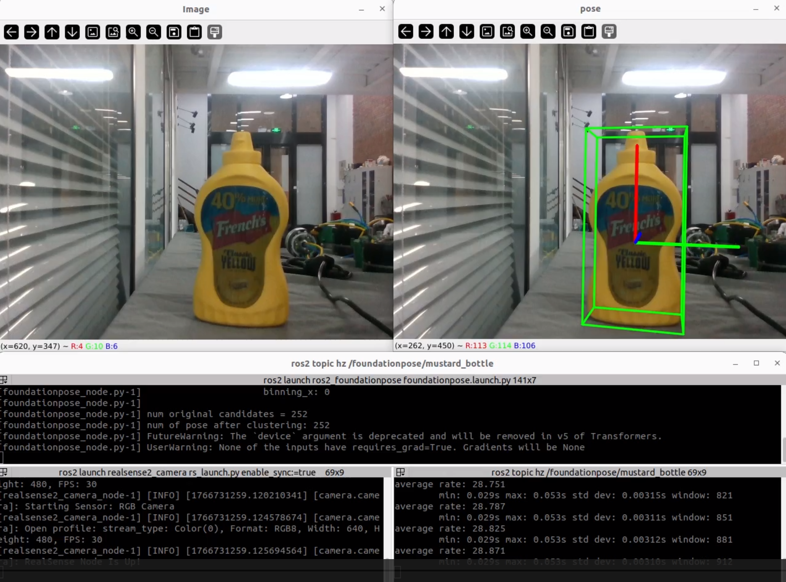

# ros2_foundationpose

A ROS 2 interface for **FoundationPose**, migrated to ROS 2 with **minimal modifications**.  
This package integrates FoundationPose into the ROS 2 ecosystem and uses **GroundingDINO** for **single-object detection**.  
It is provided as a standard ROS 2 package for easy integration into robotic systems.

---

## Tested Environment
- **Ubuntu 22.04**
- **ROS 2 Humble**
- **NVIDIA GPU (≥ 8 GB VRAM recommended)**
- **Intel RealSense Camera**

---

## Installation

> Replace `<your_conda>` and `<your_workspace>` with your own environment name and workspace path.

---

### 1. Create Workspace and Clone Repository
```bash
conda activate <your_conda>
cd <your_workspace>
mkdir -p src && cd src

git clone https://github.com/HomeworldL/ros2_foundationpose.git
cd ..
```
---

### 2. Install Python Dependencies

```bash
# PyTorch (CUDA 11.8 example)
pip install torch==2.0.1 torchvision==0.15.2 torchaudio==2.0.2 \
    --index-url https://download.pytorch.org/whl/cu118

pip install open3d omegaconf h5py supervision==0.25.1 \
    fvcore==0.1.5.post20221221 pyglet==1.5.28 \
    transformers==4.45.2 psutil joblib warp-lang==1.0.2 \
    kornia numpy==1.26.4

# PyTorch3D (CUDA 11.8 example)
pip install --no-index --no-cache-dir pytorch3d \
    -f https://dl.fbaipublicfiles.com/pytorch3d/packaging/wheels/py310_cu118_pyt201/download.html

# Fix setuptools Version
pip uninstall -y setuptools
pip install setuptools==69.5.1

bash build_all_conda.sh

# Install nvdiffrast

cd <other_dir>
git clone https://github.com/NVlabs/nvdiffrast.git
cd nvdiffrast
pip install . --no-build-isolation


# Install GroundingDINO
cd <other_dir>
git clone https://github.com/IDEA-Research/GroundingDINO.git
cd GroundingDINO
pip install -e .
```

---

### 3. Download Pretrained Weights

#### FoundationPose Weights
```bash
cd src/ros2_foundationpose/
gdown --folder https://drive.google.com/drive/folders/1BEQLZH69UO5EOfah-K9bfI3JyP9Hf7wC \
    -O ros2_foundationpose/weights/2023-10-28-18-33-37

gdown --folder https://drive.google.com/drive/folders/12Te_3TELLes5cim1d7F7EBTwUSe7iRBj \
    -O ros2_foundationpose/weights/2024-01-11-20-02-45
```

---

#### GroundingDINO Weights
```bash
cd src/ros2_foundationpose/
mkdir -p weights
cd weights
wget -q https://github.com/IDEA-Research/GroundingDINO/releases/download/v0.1.0-alpha/groundingdino_swint_ogc.pth
cd ..
```

---

### 4. Configuration
* Place the target object model (.obj/.stl) or assets in any directory
* Modify configuration files under **config/foundationpose_config.yaml** to specify:
  * obj_file
  * obj_name (for GroundingDINO)
* Modify Camera Topic under **config/foundationpose_config.yaml**
* Modify **config/pose_display.yaml** for display object

---

### 5. Build
```bash
cd <your_workspace>
colcon build --symlink-install
```

---

## Running

### 1. Launch RealSense Camera
```bash
conda activate <your_conda>

ros2 launch realsense2_camera rs_launch.py \
    enable_sync:=true \
    align_depth.enable:=true \
    enable_color:=true \
    enable_depth:=true \
    pointcloud.enable:=false
```
### 2. Launch FoundationPose Node

```bash
ros2 launch ros2_foundationpose foundationpose.launch.py
```

### Performance

* Real-time performance at approximately 30 Hz
* Actual FPS depends on GPU, resolution, and configuration



## Notes & Troubleshooting

* Ensure CUDA, PyTorch, and GPU driver versions are compatible
* Screen recording, image saving, and other operations will significantly reduce real-time performance

## Acknowledgements
* [FoundationPose](https://github.com/NVlabs/FoundationPose)
* [GroundingDINO](https://github.com/IDEA-Research/GroundingDINO)
* [FoundationPoseROS2](https://github.com/ammar-n-abbas/FoundationPoseROS2)
